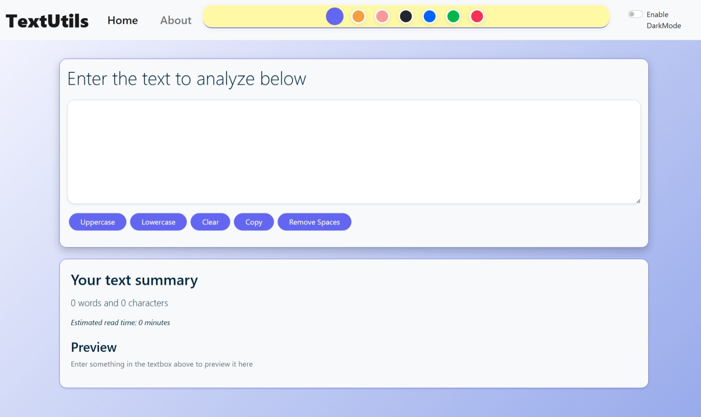

# A Text-Utility App

## 🚀 Features

- 🎨 Toggle between Light and Dark Modes
- 🌈 Choose from multiple color themes
- 🔠 Convert text to **UPPERCASE** or **lowercase**
- 🧹 **Clear** text
- 📋 **Copy** text to clipboard
- 🚫 **Remove Extra Spaces**
- 📊 Text summary: word and character count
- ⏱️ Estimated **reading time**
- 👀 Live **preview** of your text

# Tech-Stacks 
🛠️ Tech Stack

     

